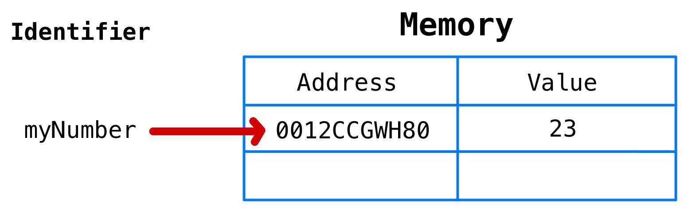

### <span style="color: skyblue">4장 변수란?</span>

       변수정도는 제대로, 엄청 자세히까지는 아니더라도 대답할정도로는 알고 있다고 생각했는데 나의 자만이었다.
       딥다이브 열심히 읽자! 완독하자! 라는 목표를 다시 한번 마음 속으로 되새기게 되었다.

---

### <span style="color: pink">1. 변수란 무엇인가? 왜 필요한가?

소제목을 읽고 나서 만약에 면접에서 이런 질문이 나왔다면 어떻게 대답할지 생각해보았다. <br /> 🗣 변수는 프로그램을 구현할 때 꼭 필요합니다... 변수는 변수입니다....

정말 어이가 없는 답변이다. 변수가 무엇이냐는 질문에 변수라는 생각밖에 떠오르지 않다니.. 다시 한번 부족함을 많이 느끼고, 지금이라도 딥다이브를 읽자고 다짐한 것에 다행이라고 생각한다.

✅ <span style="color: orange">변수는 왜 필요한가? 부터 살펴보자.</span>  
 이 장의 첫번째 줄에 '애플리케이션은 데이터를 다룬다.' 라는 말이 있다. 그렇지! 프로그래밍도 모든 것은 데이터 기반으로 이루어진다. 언제 데이터를 받아 올 것인지, 언제 이 데이터를 사용자에게 보여줄 지...  
**변수는 데이터를 관리하기 위해 필요하다!**

✅ <span style="color: orange">그럼 변수는 무엇인가?</span>

    프로그래밍 언어는 기억하고 싶은 값을 메모리에 저장하고(할당), 저장된 값을 읽어(참조) 들여 재사용하기 위해 변수라는 매커니즘을 제공한다.
    💡 변수란 하나의 값을 저장하기 위해 확보한 메모리 공간 자체 또는 그 메모리 공간을 식별하기 위해 붙인 이름을 말한다.

✅ <span style="color: orange">그럼 하나의 애플리케이션에는 수 많은 데이터가 존재하는데, 어디서 관리를 할까? </span>  
메모리라는 곳에 저장되고, 정확하게는 메모리에는 수많은 셀들이 존재한다.  
메모리 셀 하나의 크기는 1바이트이다. => 1바이트 단위로 값을 write, read 한다.  
그럼 어떻게 값을 읽어오나,,?

```js
let a = 1
let b = 2
let c = 3
let d = 4
let e = 5
let result = a + c
```

메모리 첫번째 셀부터 마지막 셀까지 다 방문하여 a 변수와 c변수가 저장된 메모리셀을 찾을까...?  
그렇다면 우리는 하나의 웹 페이지가 로딩될때까지는 엄청난 시간이 걸릴것이다...😢

그렇기 때문에 값이 저장될 때 주소가 사용된다!
이쯤되니 변수를 이해하기 위해서는 메모리가 중요하구나! 하는 생각이 들었다.

### <span style="color: pink">2. 메모리? 그리고 변수 선언, 호이스팅, 값 할당, 값 재할당

✅<span style="color: orange"> 메모리</span>

```js
let myNumber = 23
```

이 코드가 실행되면

1.  myNumber 는 어떤 값을 구별해서 식별할 수 있는 고유의 이름 Identifier (식별자) 이다.
2.  메모리에 주소를 할당를 할당한다.
3.  생성된 주소에 값(value) 을 저장한다. (23)



그럼 value를 읽어 올때, 어떻게 메모리 주소를 기억하고 value 를 가져올까?  
바로 식별자로 value 를 가져올 수 있는데, 식별자는 값을 기억하는 것이 아니라 값이 저장되어 있는 메모리 주소를 기억(저장)한다.

그럼 자세히 들어가서, 변수를 저장하면 바로 값이 저장되는 것이 아니라 undefined이 저장되고, 초기화한다고 한다. 이건 또 무슨 말일까.......😲

✅ <span style="color: orange">변수 선언, 호이스팅, 값 할당, 값 재할당</span>

위의 글에서 계속 변수를 저장한다고 적었는데, 저장 즉 할당하기 전에 변수 선언을 먼저한다!

1️⃣ 변수 선언

```js
let myNumber // 변수 선언
myNumber = 23 // 값 할당
```

```js
// 변수 선언과 값 할당을 하나의 statement 로 단축 표현할 수 있다.
let myNumber = 23 // 변수 선언과 값 할당
```

myNumber 라는 식별자를 가진 변수가 저장되는 것이 아니라 메모리에 변수 이름(식별자)가 등록되고 value을 저장할 메모리 공간이 확보된다. (선언단계) 그리고 메모리 value 에는 undefined 라는 값이 암묵적으로 할당된다. (초기화 단계)  
**<u>변수 선언에서는 선언 단계 -> 초기화 단계로 2단계에 걸쳐서 진행된다.</u>**

    선언 단계: 식별자를 등록해서 자바스크립트 엔진에 변수의 존재를 알림.
    초기화 단계: 값을 저장하기 위한 메모리 공간을 확보하고 암묵적으로 undefined 를 할당하여 초기화한다.

2️⃣ 값 할당

변수 선언 후 값 할당이 진행된다.

     변수 선언은 소스코드가 순차적으로 실행되는 시점인 런타임 이전에 먼저 실행되지만 값의 할당은 소스코드가 순차적으로 실행되는 시점인 런타임에 실행된다.

```js
console.log(score) // undefined

let score //변수 선언
score = 80 // 값 할당

console.log(score) // 80
```

💡 **변수 선언에 값을 할당 할때는 undefined가 저장되어 있던, 메모리 공간을 지우고, 그 메모리 공간에 80을 저장하는 것이 아니라, 새로운 메모리 공간을 확보하고 그곳에 할당 값 80을 저장한다!**

그럼 undefined 이는 계속해서 불필요하게 메모리를 차지하고 있는 것일까...?  
그건 아니다. 가비지 콜렉터에 의해 애플리케이션이 할당한 메모리 공간을 주기적으로 검사하여, 더 이상 사용되지 않는 메모리를 해제되지만, 단 그 시점을 알 수 없다!

3️⃣ 값 재할당

```js
let myNumber // 변수 선언
myNumber = 23 // 값 할당
myNumber = 46 // 값 재할당
```

값 재할당도 가능하지만, 이것또한 23이 있던 메모리 공간을 지우고 46 값이 할당되는 것이 아니라, 새로운 메모리 공간을 확보하고 그곳에 재할당값이 46을 저장한다. 23 메모리 공간도, 가비지 콜렉터에 의해 삭제된다!

---

1. https://medium.com/su-s-daily-log/js-memory-model-119257cda77b
2. 모던 딥다이브 자바스크립트
