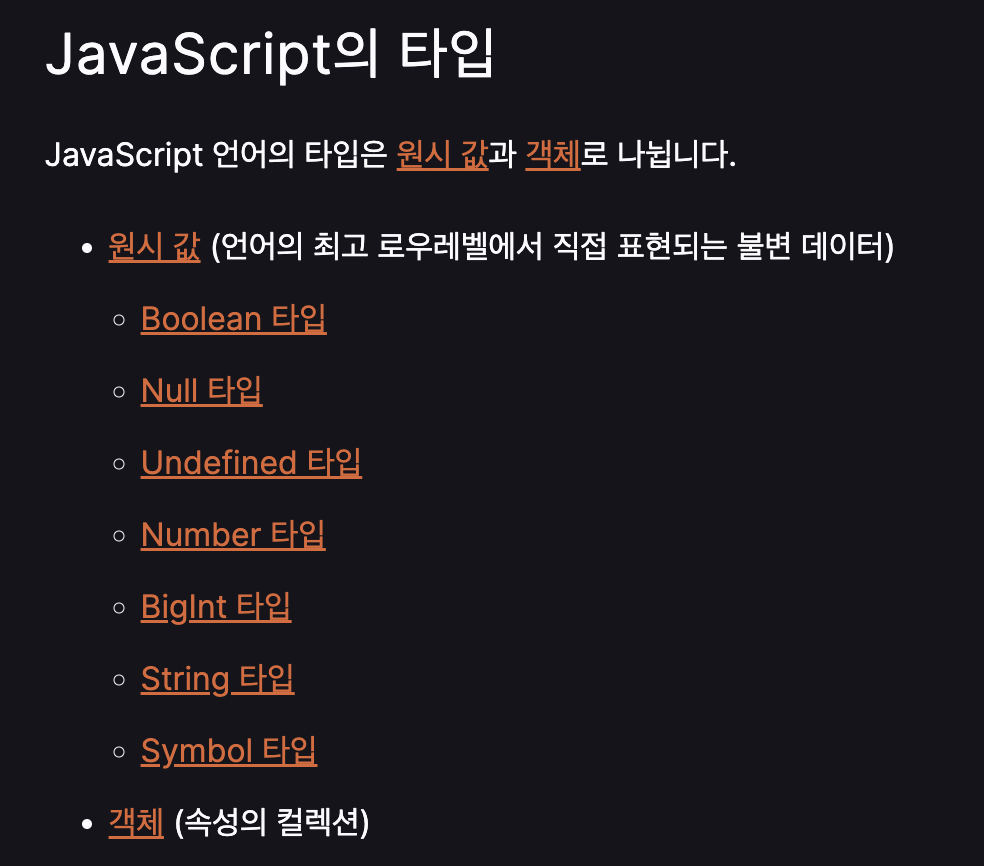

### 🚀 6장 데이터 타입

      💡 6장 데이터 타입을 읽고 간단히 정리하였습니다.

- [1️⃣ 숫자(Number) 타입](#1------number----)
- [2️⃣ 문자열(String) 타입](#2-------string----)
- [3️⃣ 템플릿 리터럴](#3----------)
- [4️⃣ 불리언(Bolean) 타입](#4-------bolean----)
- [5️⃣ Undefined 타입 , Null 타입](#5---undefined------null---)
- [6️⃣ 심벌(Symbol) 타입](#6------symbol----)
- [7️⃣ 객체 타입](#7--------)
- [8️⃣ 데이터 타입의 필요성](#8--------------)
- [9️⃣ 동적 타이핑](#9---------)
- [🔟 동적 타이핑의 문제점과 해결책](#-------------------)

---



MDN 에 기재되어 있는 JS 타입 종류. (책에 기재된 것과 같다.)  
JS의 모든 값은 데이터 타입을 갖는다!

### [1️⃣ 숫자(Number) 타입](#1------number----)

✔️ C,Java 의 경우에는 정수와 실수를 구분하여, int, long, float, double 등 다양한 숫자 타입을 제공했지만, JS 는 하나의 숫자타입만 존재한다.
즉 ✨**JS에서 숫자타입은 정수만을 위한 타입이 없고 모든 수를 실수로 처리**한다고 한다. ( JS 를 공부하기 위해 계산기를 혼자 만들어 본 적이 있는데, 이때 나누기를 하면 값이 이상하게? 나오는 경우가 있었다. [이 곳](https://velog.io/@naakite/JavaScript-%EA%B3%84%EC%82%B0%EA%B8%B0)에 계산기 구현할때 발생했던 문제점들을 정리하였다.)

숫자 타입은 Infiniy, -Infinity, Nan(not-a-number) 를 표현할 수 있다.

### 2️⃣ 문자열(String) 타입

✔️ 텍스트 데이터를 나타냄.  
✔️ 다른 타입과 달리 문자열을 따옴표로 감싸는 이유는 **키워드나 식별자 같은 토큰과 구분하기 위해**

### 3️⃣ 템플릿 리터럴

ES6부터 템플릿 리터럴이라고 하는 새로운 문자열 표기법이 도입. -> 백틱!

- 멀티라인 문자열: 일반 문자열 내에서는 개행이 허용되지 않지만(주로 이스케이프 시퀀스 사용), 템플릿 리터럴 내에서는 이스케이프 시퀀스를 사용하지 않고 줄바꿈이 허용되며, 모든 공백도 있는 그대로 적용된다.

- 표현식 삽입

  ```js
  console.log('My name is' + first + ' ' + last + ' ') // ES6 이전

  console.log(`My name is ${first} ${last}`)
  ```

### 4️⃣ 불리언(Bolean) 타입

✔️ 참, 거짓을 나타냄.

### 5️⃣ Undefined 타입 , Null 타입

✔️ Undefined 타입 : 개발자가 의도적으로 할당하기 위한 값이 아니라, 자바스크립트 엔진이 변수를 초기화할 때 사용하는 값이다.  
즉 만약 변수를 참조하였을 때 undefined 이 반환된다면, 참조한 변수가 선언 이후 값이 할당된 적이 없는, 즉 초기화되지 않은 변수라는 것이다.

```js
let foo
console.log(foo)
```

✔️ Null 타입 : 변수에 값이 없다는 것을 의도적으로 명시할 때 사용한다.
또, 함수가 유효한 값을 반환할 수 없는 경우에도 명시적으로 null을 반환한다.

```js
  <!DOCTYPE html>
  <html>
  <body>
      <script>

          let element = document.querySelector('.myClass');
          console.log(element); // null
      </script>
  </body>
  </html>
```

     💡 선언과 정의
     ECMAScript 사양에서 변수는 '선언한다' , 함수는 '정의한다' 로 표현한다.

### 6️⃣ 심벌(Symbol) 타입

**✔️ ES6에서 추가된 7번째 타입으로 심벌 값은 다른 값과 중복되지 않는 유일무이한 값이다.** 아직 개인적으로 심벌 타입은 아직 사용해본적은 없다..  
심벌 이외의 원시 값은 리터럴을 통해 생성하지만, 심벌은 Symbol 함수를 통해 생성한다. 이때 생성된 심벌 값은 외부에 노출되지 않으며, 다른 값과 절대 중복되지 않는 유일무이한 값이다.

```js
let key = Symbol('key')
console.log(typeof key) //symbol

let obj = {}

obj[key] = 'value'
console.log(obj[key]) // value
```

33장에서 자세히 살펴볼 예정이다...

### 7️⃣ 객체 타입

✨ **자바스크립트는 객체 기반의 언어이며, 6개의 타입 이외에 자바스크릡트를 이루고 있는 거의 모든 것이 객체이다.**

11장에서 자세히 살펴볼 예정이다...

### 8️⃣ 데이터 타입의 필요성

💡 **값을 저장할 때 확보해야 하는 메모리 공간의 크기를 결정하기 위해**  
 💡 **값을 참조할 때 한 번에 읽어 들여야 할 메모리 공간의 크기를 결정하기 위해**  
💡 **메모리에서 읽어 들인 2진수를 어떻게 해석할지 결정하기 위해**

### 9️⃣ 동적 타이핑

1.  정적 타입 언어: 변수를 선언할 때 변수에 할당할 수 있는 데이터 타입을 사전에 선언해야함. (= 명시적 타입 선언) ex: C, Java  
    ✔️ 변수의 타입 변경할 수 없다.  
    ✔️ 변수에 선언한 타입에 맞는 값만 할당 가능.  
    ✔️ 컴파일 시점에 타입 체크를 수행하여서, 타입 체크에 통과하지 못하면 에러 발생 , 프로그램 실행 자체를 막음 -> 타입의 일관성 강제, 안정적인 코드 구현 가능, 런타임에 발생하는 에러 줄임.

```c
   char c;
   int num;
```

2.  동적 타입 언어: 선언이 아닌 할당에 의해 타입이 결정, 즉 할당하는 시점에 변수의 타입이 동적으로 결정된다. (=타입 추론) ex: JavaScript
    ✔️ 재할당에 의해 변수의 타입은 언제든지 동적으로 변함.

💡 다시 정리하자면, 정적 타입 언어는 미리 선언한 데이터 타입의 값만 할당 할 수 있다. 반대로 동적 타입 언어는 데이터 타입을 미리 선언하지 않기 때문에, 자유롭게 할당할 수 있다.

### 🔟 동적 타이핑의 문제점과 해결책

변수 값이 언제든지 변경될 수 있기 때문에 복잡한 프로그램에서는 변수 값을 추적하기 어려울 수 있다. 또, 변수의 타입이 고정되어 있지 않기때문에, 동적 타입 언어의 변수는 값을 확인하기 전까지는 타입을 확신할 수 없다.  
게다가 개발자의 의도와 상관없이 JS 엔진에 의해 암묵적으로 타입이 자동으로 변환되기도 한다!!😬

그렇기 때문에 변수를 사용할 때 주의 사항이 있다!!

1. 변수는 꼭 필요한 경우에 한해 제한적으로 사용.
2. 변수의 유효 스코프는 최대한 좁게 만들어 변수의 부작용을 억제해야한다. (13장)
3. 전역 변수는 최대한 사용하지 않도 한다. (14장)
4. 변수보다는 상수를 사용하여 값의 변경을 억제하자. (15장)
5. 변수의 이름은 변수의 목적이나 의미를 파악할 수 있도록 네이밍하자. (항상 매번 고민하게 된다... 변수 네이밍...🤔)

✨ 마지막으로 6장의 마지막 장에 공감하고, 내가 항상 고민해야하는 부분인 글귀가 있었다.

> 코드는 동작하는 것만으로 존재 목적은 아니다. 코드는 개발자를 위한 문서이기도 하다.  
> 따라서 사람이 이해할 수 있는 코드, 즉 가독성이 좋은 코드가 좋은 코드이다.

명심하자!
