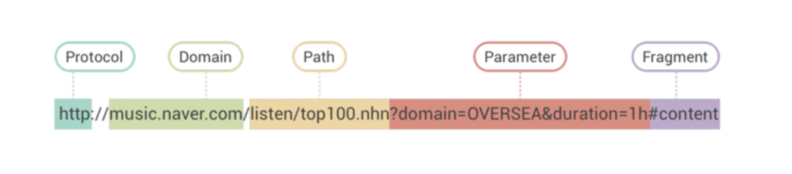

## 🚀 HTTP 에 대해 알아보자.

      간단하게 알아보자! HTTP!

---

작성일: 7월 6일

## 💡 HTTP(Hypertext Transfer Protocol )

HTTP는 인터넷상에서 `데이터를 주고 받기 위한 서버/클라이언트 모델을 따르는 통신 프로토콜`이다. `통신 프로토콜은 통신 규칙`이다. 사람들이 의사소통을 할때도 언어의 문법이라는 일련의 약속이 필요하듯이 통신 프로토콜은 컴퓨터나 통신 장비들끼리 원활한 데이터 교환을 수행하기 위해 표준화한 통신 규약이다.

## 📤 HTTP Request

**프론트엔드에서 백엔드에 보내는 요청**

### 1. Start Line

- HTTP Method : 해당 요청이 의도한 action 을 정의
  ex) GET, POST, PUT, DELETE, OPTIONS ...
- Request target : 해당 요청이 전송되는 목표 url
  ex ) /diary
- HTTP Version

> start line 예시

    GET/ search HTTP/ 1.1

### 2. Headers

- 해당 요청에 대한 추가 정보를 담고 있다.
- key:value
  ex) HOST: google.com

1. HOST: 요청이 전송되는 URL
2. User-Agent : 요청을 보내는 클라이언트에 대한 정보.
3. Accept: 해당 요청이 받을 수 있는 응답 타입.
4. Connection : 해당 요청이 끝난후에 클라이언트와 서버가 계속해서 네트워크 커네션을 유지할 것인지 아니면 끊을 것인지에 대한 지시.

```
Connection: keep-alive
Connection: close
```

5. Content-Type : 해당 요청이 보내는 메세지 body의 타입.
6. Content-Length: 메시지 body의 길이

### 3. Body

- 해당 request 의 실제 내용
- body가 없는 요청도 있다. -> ex) GET request

## 📩 HTTP Response

**요청에 대한 응답**

### 1. Status Line

- HTTP 버전
- Status code:요청의 성공 여부.
- Status text : 응답 상태를 간략하게 설명해주는 부분. ex ) "Not Found"

### 2. Headers

- Response의 headers와 동일.
- 다만 response에서만 사용되는 header 값들 존재.
  ex ) User-Agent -> Server 헤더 사용.

### 3. Body

- Response의 Body와 일반적으로 동일.

## 📎 URL

서버에 자원을 요청하기 위해 입력하는 영문 주소.



1. 스킴 (=프로토콜): 리소스를 가져올때, 어떤 프로토콜을 사용하여 서버에 접근할 것 인지 .
2. path(/) : 파일의 경로를 가리킴. / 뒤에 나옴.
3. parameter (?) = 쿼리 스트링: key(파라미터의 이름)=value(파라미터의 값) 형태.  
   ? 뒤에 나열되고, & 기호로 구분된다. 여러개 존재 가능.
4. fragment (#) : 해시태그 라고 불린다. 특정 요소 지시.

## 🆘 HTTP Statues Code

1xx(정보) : 요청을 받았으며 프로세스를 계속 진행합니다. <br />
2xx(성공) : 요청을 성공적으로 받았으며 인식했고 수용하였습니다. <br />
3xx(리다이렉션) : 요청 완료를 위해 추가 작업 조치가 필요합니다.<br />
4xx(클라이언트 오류) : 요청의 문법이 잘못되었거나 요청을 처리할 수 없습니다. <br />
5xx(서버 오류) : 서버가 명백히 유효한 요청에 대한 충족을 실패했습니다.<br />

---

### 🖇 참고

https://www.whatap.io/ko/blog/40/

https://velog.io/@mokyoungg/HTTP-HTTP-%EA%B5%AC%EC%A1%B0-%EB%B0%8F-%ED%95%B5%EC%8B%AC-%EC%9A%94%E3%85%85
