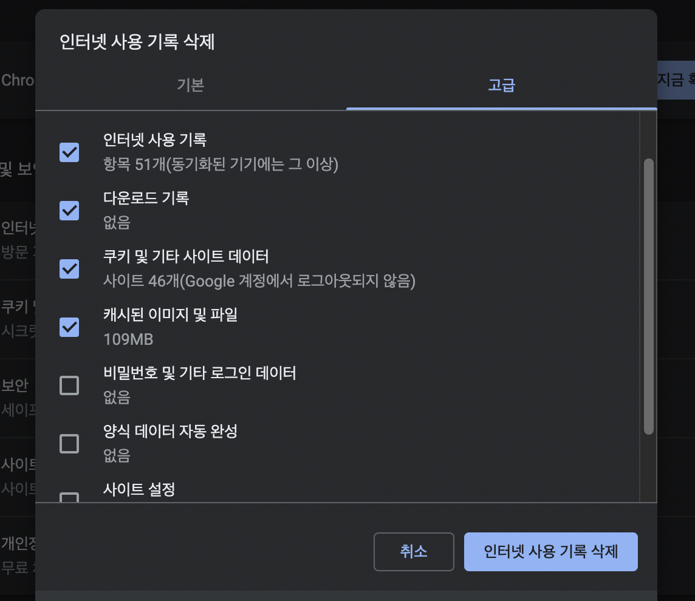

## 🚀 local storage vs session storage vs cookie

#### [면접스터디 관련 자료](https://github.com/baeharam/Must-Know-About-Frontend/blob/main/Notes/cssmargin-collapsing.md) 를 읽고 나서 데이터 저장소 관련하여 추가적으로 정리하였습니다.

---

작성일: 2022년 4월 19일

### 💡 localStorage vs session storage vs cookie

공통점은? **데이터 저장소이며 'key-value' 값으로 데이터를 저장, 모든 key와 value는 항상 string로 저장된다** 는 것이다!  
그럼 가장 큰 차이점은? **데이터 보관기간** 이라고 한다.

### 🤔 그런데 데이터 저장소가 왜 필요한지 궁금해졌다...서버가 있는데..? 굳이 ?....이것부터 알아보자!

찾아보니, HTTP 특징과 관련이 있었다..그럼 먼저 HTTP 에 대해 정리해보자!

### ⛔️ HTTP (Hypertext Transfer Protocol)

**텍스트 기반의 통신 규약!** 웹에서 클라이언트와 서버의 데이터 통신을 위해 HTTP 프로토콜을 사용한다!

가장 큰 특징 두가지가 있는데, Connectionless 와 Stateless 이다.

✅ Connectionless

- 클라이언트가 요청을 한 후 응답을 받으면 그 연결을 끊어버린다.

✅ Stateless

- Connectionless특징으로 인해 서버는 클라이언트를 식별할 수가 없는데, 이것을 Stateless라고 한다.  
   예를 들어, 쇼핑몰에서 옷을 구매하기 위해 로그인 화면에서 로그인을 하였지만! 페이지를 이동하게 되면 로그인한 상태가 유지되지 않는다!

### 이런 HTTP의 단점을 보완하기 위해 나타난 🍪...👍

### 1️⃣ Cookie?

(초등학생 시절 학교에서 배웠던 인터넷 사용법...중에서 임시쿠키 삭제하기가 떠올랐다..😆)

HTTP의 단점을 보완하기 위해 나타난 것이 Cookie다!!  
서버에 데이터를 공유하는 용도로 사용된다. **최대용량은 5KB로 webStorage 보다 저장할 수 있는 용량이 작다.**

사용자가 어떠한 퉵사이트를 방문하였을 때, 그 사이트가 사용하고 있는 서버를 통해 사용자의 컴퓨터에 작은 기록 정보  
 파일을 의미한다.

SSR방식에서 쿠키의 장점이 조금 더 활용되는데, **쿠키는 webStroage 와 달리 서버와 통신**을 하기 때문에,  
서버에서 html을 렌더링 할 때, 더욱 많은 정보를 담을 수 있고(Header에 실려온다.), 로딩시간을 단축시킨다.
쿠키에도 두 가지로 나뉘는데, Persistent Cookie(만료 기간 존재-> 브라우저가 종료되어도 남아있지만, 만료기간이 끝나면 삭제된다! ), Session Cookie(만료 기간 없음 -> 브라우저 종료 시 삭제) 로 나뉜다.

쿠키에도 단점이 있는데 바로 **보안 문제와 트래픽 증가** 가 있다.  
보안 문제 종류에는 CSRF(사용자 권한을 이용한 공격, 사이트에 로그인이 되어있는 사용자에게 악성 스크립트를 실행), XSS(사용자의 민감한 정보 탈취) 가 있다. 트래픽 증가에는 http 요청할때마다 자동으로 모든 쿠키가 전송되기 때문에, 불필요한 트래픽이 증가될 수 있다고 한다.

이러한 쿠키의 단점을 보완하기 위해 HTML5에서 새로운 것? 이 만들어진다!!

### 2️⃣ Web Storage?

Web Storage는 local Storage 와 session Storage 로 나누어진다.  
Web Storage는 쿠키의 보안 문제와 트래픽 문제를 보완하였는데, 쿠키는 http를 요청할때 마다 Header 에 모든 쿠키를 전송하였지만, Web Storage 는 오직 사용자의 브라우저에 저장된다 즉 서버 전송 X!! 또 쿠키보다 많은 양의 데이터를 저장할 수 있다.(5MB - 10MB) 그리고 Web Storage의 데이터는 String형으로 키(key)와 값(value) 으로 저장되어 있으며, 웹 페이지는 저장된 그 자체로만 접근이 가능하다. 만약 Array, Object형태로 적용하기 위해서는 JSON.stringfy() 를 사용해서 문자열로 변환하여 저장하여야 한다.

그럼 local Storage 와 session Storage 의 차이는 무엇일까...?

Persistent Cookie, Session Cookie 차이점과 마찬가지로 local Storage 는 데이터에 유효기간이 없지만, session Storage 는 브라우저가 종료시 데이터가 초기화된다는 차이점이 있다.

🌱🌱🌱🌱🌱🌱🌱🌱🌱🌱🌱🌱🌱🌱🌱🌱🌱🌱🌱🌱🌱🌱🌱🌱🌱🌱🌱🌱🌱🌱🌱🌱🌱🌱🌱🌱🌱🌱🌱🌱🌱🌱🌱🌱🌱🌱🌱🌱🌱🌱🌱🌱🌱🌱🌱

처음에는 간단하게 local Storage, session Storage, cookie 에 대해서만 정리하려고 했던 글이였는데, 글을 적다보니 왜 cookie 가 생겨난 건지 궁금해서 이유를 찾다보니 글이 생각보다 길어지게 된 것 같다...사실 local Storage 와 session Storage 에 대한 것을 자세히 적고 싶었는데...짧아져서 약간 아쉽기도 하지만..그래도 발생된 순서를 알게 되어서 뿌듯하다..!! 요즘 개발 일지 WIL을 적으면서 느끼는 것이 있는데, 📌 **원인없는 결과는 없다.** 는 문장이 생각난다. 나도 나중에.. 취업을 위해서!! 좋은 결과를 만들기 위해, 좋은 원인? 을 만들어 나가는 과정을 만들어 나가는 사람이 되도록 노력하자...!

---

https://developer.mozilla.org/ko/docs/Web/HTTP/Overview

https://erwinousy.medium.com/%EC%BF%A0%ED%82%A4-vs-%EB%A1%9C%EC%BB%AC%EC%8A%A4%ED%86%A0%EB%A6%AC%EC%A7%80-%EC%B0%A8%EC%9D%B4%EC%A0%90%EC%9D%80-%EB%AC%B4%EC%97%87%EC%9D%BC%EA%B9%8C-28b8db2ca7b2

https://velog.io/@kenatman/General-%EC%BF%A0%ED%82%A4-%EC%84%B8%EC%85%98%EC%8A%A4%ED%86%A0%EB%A6%AC%EC%A7%80-%EB%A1%9C%EC%BB%AC%EC%8A%A4%ED%86%A0%EB%A6%AC%EC%A7%80

https://victorydntmd.tistory.com/286

https://geonlee.tistory.com/127
