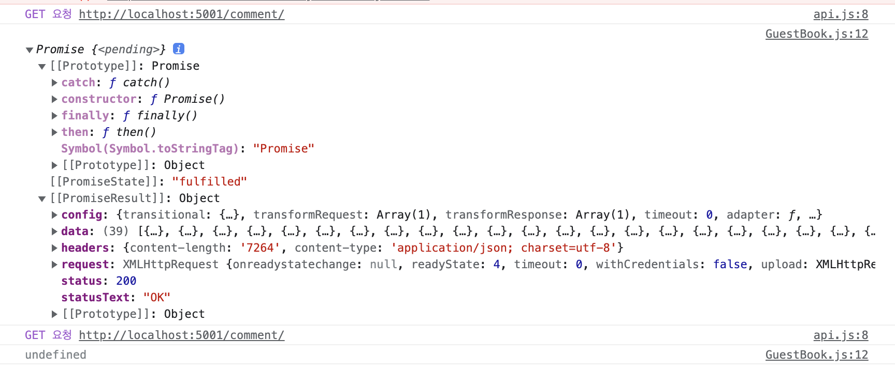

## 🚀 axios await/async vs then

작성일: 2022년 5월 13일

두번째 프로젝트 배포 당일 밤을 꼬박 새우고 아침에 급하게 기능을 추가해야하는 일이 생겼다.  
프론트에서는 내가 맡아서 하게 되었는데, 간단한 기능이여서 빨리 끝낼 수 있다는 내 예상과 달리,백 연결에서 문제가 생겼다. axios 를 이용해서 get 요청을 했는데, data를 가져오지 못했다..😵‍💫 처음에는 axios 문제인지 모르고 다른 부분에 문제인건가 하는 생각이 들어 이리저리 고쳐보다 분명히 1차 프로젝트 때처럼 했는데, 왜 이럴까...한참 고민하다 그냥 then 을 이용하니 data 를 가져올 수 있었다...거의 1시간 동안의 삽질이였다...

### 문제의 코드..🥲

```js
  const [commentList, setCommentList] = useState([]);
  useEffect(() => {
    try {
      const res = Api.get('comment');
     console.log(res.data); // undefined
  }, []);
```

### 해결 방법

```js
const [commentList, setCommentList] = useState([]);
useEffect(() => {
  try {
    Api.get('comment').then((res) => {
      setCommentList(res.data);
    });
  } catch (error) {
    console.log(error);
  }
}, []);
```

### ⚠️ const 와 then 의 차이...?

처음에는 변수로 받는 것과 then 으로 가져오는 것에 대한 차이인 줄 알았다. 나도 모르는 차이점이 있구나 하고...프로젝트 기간이 끝나고 이 문제의 원인을 알기 위해 아무리 구글에 검색을 해도 이 둘의 차이점은 나오지 않았다. 근데 내가 생각해도...차이가 있나 하는 생각이 들었다. 다시 문제의 코드를 보니..await async 를 사용하지 않았다는 것을 알게 되었다..🥲  
async await 를 사용해서 다시 코드를 작성해보니 문제없이 data 를 가져왔다..!!

```js
const [commentList, setCommentList] = useState([]);
useEffect(() => {
  sample();
}, []);

const sample = async () => {
  const res = await Api.get('comment');
  setCommentList(res.data);
};
```

**그럼 then을 사용하면 async await 를 사용하지 않아도 된다는 것인가?** 하는 생각이 들었다. 🤦‍♀️  
글을 정리하면서 적는 이 순간에도 이런 것을 제대로 몰랐다는 것에 대해 너무..어이가 없다.  
심지어 부끄럽게도 드림코딩 유튜브를 통해 듣고 정리까지 한 부분들인데,,,,아무 생각없이 했구나. 하는 생각이 들었다.

**그래서 이번 글의 주제는 axios then , await/async 이다!**

### ⚠️ 일단 비동기 다시 한번 더 알아보자!

비동기는 잘 안다고 생각했는데,,,역시 나의 착각이다. 제일 중요한 것을 잊어버리다니.....😡  
비동기는 무엇일까? 부터 다시 간단하게! 한번 정리해보자.  
동기는 순차적으로 코드가 실행되는 것이다. 그럼 비동기는? 순차적으로 실행되지 않는 것! 이전 작업 수행 중에도 다른 작업을 수행할 수 있게 하는 것이다!

### ⭐️ Promise란?

```js
  const [commentList, setCommentList] = useState([]);
  useEffect(() => {
    try {
      const res = Api.get('comment');
     console.log(res); // Promise 객체
     console.log(res.data); // undefined
  }, []);
```

위의 코드에서 console.log(res) 는 Promise 객체가 출력되고, console.log(res.data) 는 undefined 이 출력되는 것을 볼 수 있다.


나는 출력된 Promise 객체를 보고, 어! 어디서 봤는데? 하고 지나쳤다... 그저 왜 res.data 가 undefined 으로 출력되는 이유에만 집중을 하고 왜 안되지? 만 반복했었다.🤦‍♀️  
왜 안된걸까? then 을 써야지!!!!!!!!  
일단 Promise 가 무엇인지부터 다시 정리해보자! (callback 은 여기서는 정리하지 않겠다. )

✅ **Promise?**

> 쉽게 말해, 비동기를 구현할 때 사용되는 객체이다.

예전에 velog 에 드림코딩 유튜브 강의 중 비동기편에서 정리해놓은 글이다. Promise 는 비동기를 구현할 때 사용되는 객체이다!

조금 더 추가하자면,

> 실행은 바로 하지만, 데이터를 다 받아오기 전에 데이터를 화면에 표시하려고 하면, 오류가 발생하거나 빈 화면이 출력된다. 이러한 문제점을 해결하는 것이 프로미스다!

✅ **Promise 사용하기 위해서는 then 을 이용한다!**

프로미스 상태정보에는  
panding(비동기 처리가 아직 수행되지 않은 상태 = 프로미스가 생성된 직후 기본 상태),
fulfilled(비동기 처리가 수행된 상태(성공)= resolve 함수 호출),
rejected(비동기 처리가 수행된 상태(실패)= reject 함수 호출),
seletted(비동기 처리 성공,실패와 상관없이 비동기 처리가 수행된 상태) 가 있다.

그리고 만들어진 프로미스 객체를 사용하기 위해 then, catch, finally 가 있다.
then : 비동기 처리가 성공했을 때 호출되는 콜백함수와 실패했을 때 호출되는 콜백함수 총 두 개의 콜백 함수를 인수로 전달받는다.  
finally : 프로미스의 성공, 실패와 상관없이 무조건 한번 호출된다.  
catch: 프로미스 상태가 rejected 인 경우에만 호출.

아래의 순서도를 통해 더 자세히 이해할 수 있다!


그럼 나의 문제의 코드를 완벽하게 Promise 를 이용한 코드로 수정하면, 일단 에러처리를 try catch 구문이 아닌 catch 메서드를 사용해야한다!

```js
const [commentList, setCommentList] = useState([]);
useEffect(() => {
  Api.get('comment')
    .then((res) => {
      setCommentList(res.data);
    })
    .catch((err) => {
      console.log('then error: ', err);
    });
}, []);
```

### ⭐️ 그럼 async/ await ?

> 가장 최근에 나온 비동기 처리 문법으로 Promise 의 단점을 보완하기 위해! 나왔다.

Promise 의 단점이 무엇일까? 바로 then 지옥, 꼬리에 꼬리를 무는 코드가 될 수 있다는 것이다. async/ await 는 이런 promise 의 단점을 보완하여, 가독성이 좋다!

✅ **기본 문법**

```js
async function 함수명() {
  await 비동기_처리_메서드_명();
}
```

✔️ **async** : function 앞에 async 를 붙이면, 해당 함수는 항상 Promise 를 반환하게 된다!  
만약 Promise 가 아닌 값이 반환 되더라도 이행 상태의 Promise 로 값을 감싸 Promise 가 반환된다고 한다!

✔️ **await** : async 함수 안에서만 작동! 자바스크립트는 await 키워드를 만나면, Promise 가 처리될 때 까지 기다린다!

⚠️ 단 try ~ catch 구문을 이용하여 에러 처리를 해줘야 한다!

⚠️ 최상위 레벨 코드에서는 작동하지 않는데, 익명 async 함수로 코드를 감사면 최상위 레벨 코드에도 await 를 사용할 수 있다!

```js
(async () => {
  let response = await fetch('/article/promise-chaining/user.json');
  let user = await response.json();
  ...
})();

```

### 마무리

너무 어처구니 없고, 부끄러운 실수였다.  
지금이라도 알게되어 매우 다행이다...🥲  
제대로 공부하자!

---

https://ko.javascript.info/async-await  
드림코딩 정리 글 : https://velog.io/@naakite/6-Callback-Promise
