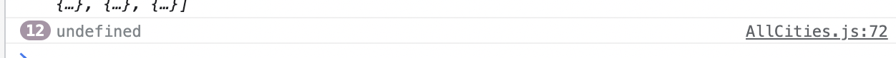
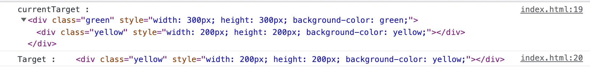

## 🚀 currentTarget vs target

작성일: 2022년 5월 12일

### 📌 평소대로 e.target.value를 이용했는데, 클릭한 요소값을 가져오지 못한다..?😬<br />

2차 팀프로젝트에서 발생한 문제점이다...!! 평소처럼 e.target.value 를 이용해서 클릭한 요소를 가져올려고 했으나, undefined 이 출력되었다.  
다행히 구글링을 통해서 알아낸 e.currentTarget.value 를 사용하니 문제는 해결되었다.  
그럼 event target 와 currentTarget 차이점은 무엇일까..?



### ✅ event.target vs event.currentTarget

블로그에 기재되었는 코드를 먼저 실행해보자. (출처 아래에 기재)

```html
 <body>
    <tbody>
      <div class="green" style="width: 300px; height: 300px; background-color: green;">
          <div class="yellow" style="width: 200px; height: 200px; background-color: yellow;"></div>
      </div>
      </tr>
    </tbody>
    <script>
        const green = document.querySelector('.green');
        green.addEventListener('click',function(e){
            console.log("currentTarget : ",e.currentTarget);
            console.log("Target : ",e.target);
        })
    </script>
  </body>
```

위의 코드를 실행하고, yellow을 클릭하였때 결과는 아래와 같이 나온다.  
green 이라는 className 을 가진 div에 이벤트 핸들러를 설정하였는데, currentTarget 은 자기자신(이벤트가 달려있는 요소)과 자식요소까지 출력되는 것을, target 는 자식요소(내가 누른 대상!-> yellow)만 출력되는 것을 볼 수 있다.


그럼 오류가 발생했던 프로젝트 코드를 예시로 들어보자. 일단 코드가 복잡해서 임의로 간단하게 만들었다.

```js
const SurveyContainer = () => {
  const handleClickAnswer = (e) => {
    console.log('e.target.value', e.target.value);
    console.log('e.currentTarget.value', e.currentTarget.value);
  };

  return (
    <>
      <div>
        <button onClick={handleClickAnswer} value={'button에 value'}>
          <span>click</span>
        </button>
      </div>
    </>
  );
};
```

e.target.value 를 했을 때 undefined 가 출력되는 것을 볼 수 있다! 왜냐하면 이벤트 핸들러가 달려있는 button 에 value 값을 지정했는데, e.target.value 를 사용하면, 내가 클릭한 대상인 span의 value 값을 출력하려고 하기때문이다..(물론 span 에는 value 값을 쓰지 않는다..!)


⚠️ **다시 한번 정리하면**
✅ event.target : 내가 누른 대상! , 이벤트가 달려있는 요소의 자식 요소.
✅ evnet.currentTarget : 이벤트가 달려 있는 요소!

추가적으로 MDN 에 있는 Event.currentTarget 에 대한 설명을 읽어보면, 동일한 이벤트핸들러를 여러 요소에 사용할 때 효과적이라고 한다!

---

https://developer.mozilla.org/en-US/docs/Web/API/Event/currentTarget  
https://kyounghwan01.github.io/blog/JS/JSbasic/target-currentTarget/
