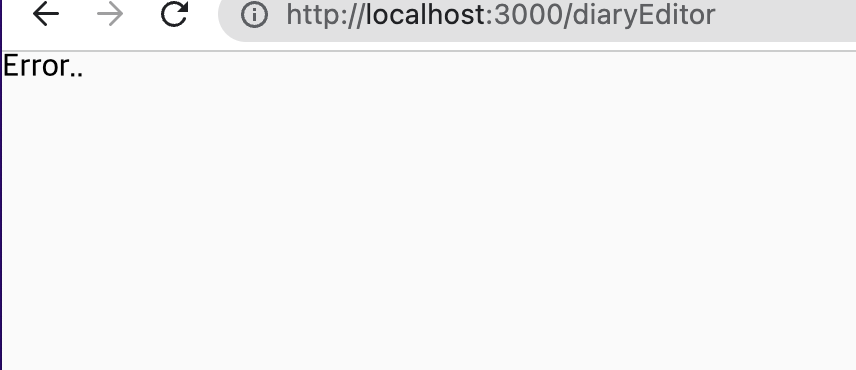
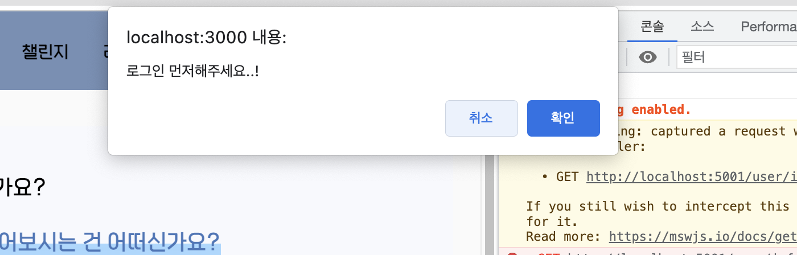

## Recoil Selector 사용

> 3차 팀프로젝트 Recoil 사용 후기를 작성해보자! (1)

## 💡 Selector 사용

### 세션 로그인 🔑

1차 프로젝트 때는 jwt 토큰 방식으로 로그인을 구현하였지만, 3차 프로젝트에는 세션 로그인을 구현하여서, 사용자 전역 상태 관리를 어떻게 할지 고민을 했었다..??

jwt 토큰 방식은 클라이언트에서 서버에서 발급받은 토큰을 요청할 때마다, 같이 보내는 방식이기 때문에,  
session storage에 토큰이 있는지 확인하고, 토큰이 있다면 -> 현재 로그인 상태 / 없다면 -> 로그인 X 상태로 구분하여서,  
로그인하지 않은 사용자가 로그인 후에만 이용 가능한 페이지에 접속되는 것을 방지할 수 있었는데,세션 로그인은 `withCredentials` 설정만 하면, 클라이언트에서 서버로 요청을 보낼 때, 쿠키에 저장된 세션 ID가 요청에 포함된다!

그래서 처음에는 쿠키에 세션 ID가 존재하면 -> 로그인 상태로 구현하려고 했다!  
react-cookie 라이브러리를 사용해서 쿠키에 저장된 세션 ID 값 존재를 판단하고자 했지만,  
클라이언트에서 쿠키에 저장한 데이터는 가져올 수 있지만, 서버에서 저장한 데이터는 가져올 수 없었다..  
(근데 아직 이유를 못 찾았다...보안 정책 때문인 건지...?)

그래서 차선책으로 로그인 후 메인페이지로 접속되면 사용자의 정보를 가져오는데, 이 부분을 이용해서 loginState atom 을 만들고,  
 정보를 받아오면 loginState atom 을 업데이트하고, 다른 페이지로 사용자가 접근할 때, loginState atom 에 값이 있는지? 로 접근을 제한하는 방법을 선택했다!

### Recoil Selector 도 사용해봐야지..?

다른 요청을 selector 로 사용하지 않았던 이유는, 전역 상태로 관리할만한 상태값이 없어서 사용하지 못했는데, 로그인 상태는 recoil 을 사용해서 전역으로 관리하니 selector 를 이참에 사용해봐야겠다는 생각이 들었다.

```js
//atom.js
export const userState = atom({
  key: 'userState',
  default: [],
});

export const getUserSelector = selector({
  key: 'user/get',
  get: async () => {
    try {
      const data = await Api.get('user/info');
      return data.data;
    } catch (err) {
      throw new '테스트 오류'();
    }
  },
  set: ({ set }, newValue) => {
    set(userState, newValue);
  },
});
```

```js
//index.js
const root = ReactDOM.createRoot(document.getElementById('root'));
root.render(
  <>
    <GlobalStyle />
    <ThemeProvider theme={Theme}>
      <RecoilRoot>
        <Suspense fallback={<div>Loading...</div>}>
          <App />
        </Suspense>
      </RecoilRoot>
    </ThemeProvider>
  </>
);
```

잘 동작하고, 유저 정보도 userState 에 잘 업데이트 되었다!👍

### 🎣 catch ?

이제 error 가 발생했을 때! , 즉 로그인하지 않은 상태에서 get 요청을 하면 에러가 발생하고, 에러를 발생했을 때, 다시 랜딩 페이지로 이동하면 구현은 끝난다!

```js
const getError = () => {
  const navigate = useNavigate();
  navigate('/');
};

export const userState = atom({
  key: 'userState',
  default: [],
});

export const getUserSelector = selector({
  key: 'user/get',
  get: async () => {
    try {
      const data = await Api.get('user/info');
      return data.data;
    } catch (err) {
      getError();
    }
  },
  set: ({ set }, newValue) => {
    set(userState, newValue);
  },
});
```

useNavigate는 최상위에서 호출이 될 수 없기 때문에, 함수 안에서 호출했지만 아래와 같은 에러가 발생하였다..

> React Hook "useNavigate" cannot be called at the top level. React Hooks must be called in a React function component or a custom React Hook function.

그래서 위의 코드처럼 함수 안에서 호출하면 아래와 같은 에러가 발생하였다..

> React Hook "useNavigate" is called in function "getError" that is neither a React function component nor a custom React Hook function. React component names must start with an uppercase letter. React Hook names must start with the word "use".

하지만 해결방법은 찾을 수 없었고,,,일정은 촉박했기에....⛰  
빠르게 차선책으로 넘어갔다.

#### ✅ 첫번째 시도 : ErrorBoundary

```js
root.render(
  <>
    <GlobalStyle />
    <ThemeProvider theme={Theme}>
      <RecoilRoot>
        <ErrorBoundary fallback={<div>Error..</div>}>
          <Suspense fallback={<div>Loading...</div>}>
            <App />
          </Suspense>
        </ErrorBoundary>
      </RecoilRoot>
    </ThemeProvider>
  </>
);
```

ErrorBoundary 을 사용하니, 잘 실행되었지만! 에러 발생도 잘 출력되었지만!



fallback 에서 함수를 호출하게 해서 navigate 를 사용했을 때는 또 똑같은 에러가 발생했다.

(+ 이때는 빠르게 다음으로 넘어갔는데, 지금 글을 작성하면서 ErrorBoundary 에 대해 찾아보니

> React는 16 버전부터 앱의 하위 컴포넌트 트리에서 발생하는 자바스크립트 에러를 기록하며 깨진 컴포넌트 트리 대신 폴백 UI를 보여주는 ErrorBoundary라는 개념을 도입하였다.
> ErrorBoundary를 통해 컴포넌트에서 에러가 발생했을 때 이를 캐치하여 리포팅하고, 사용자들에게 에러가 발생하여 앱이 중단되는 것이 아닌 다른 대체 화면을 보여줄 수 있다.

아마 UI 를 보여주는 것이니, useNavigate 를 사용했을 때, 에러가 발생한 것이 아닐까..하는 생각이 든다. )

아무튼, 그래서 시도한 두번째 방법.

#### ✅ 두번째 시도 : Loadable

Loadable 란? atom 이나 selector의 현재 상태를 나타내는 객체.

1. state : hasValue , hasError , loading atom 이나 selector의 상태를 말하며, 앞의 세 가지 상태를 가질 수 있습니다.
2. contents : atom이나 contents의 값을 나타내며, 상태에 따라 다른 값을 가지고 있습니다. hasValue 상태일 땐 value를, hasError 일 땐 Error 객체를, 그리고 loading 일 땐 Promise를 가지고 있습니다.

아래와 같이, hasValue 상태일 때, userState atom에 가져온 값을 업데이트하고,
error 가 발생할 때 confirm 창을 띄워서, 로그인 화면으로 이동할 수 있도록 구현했다!

```js
import { useRecoilValueLoadable, useSetRecoilState } from 'recoil';
import { useNavigate } from 'react-router-dom';
import { getUserSelector, userState } from '../atoms';

const useCheckUser = () => {
  const navigate = useNavigate();
  const userLoadable = useRecoilValueLoadable(getUserSelector);
  const setUserState = useSetRecoilState(userState);

  let user = ' ';
  switch (userLoadable.state) {
    case 'hasValue':
      user = userLoadable.contents;
      setUserState(user);
      break;
    case 'hasError':
      console.log('error');
      if (window.confirm('로그인 먼저해주세요..!')) {
        navigate('/login');
      } else {
        navigate('/');
      }
      break;
    case 'loading':
      <h1>loading</h1>;
      break;
    default:
      user = 'Loading...';
  }

  return user;
};

export default useCheckUser;
```

드디어 .. 🎉🎉🎉



다만, 최종적인 코드는 Selector 사용은 하지 않고 있다.....  
그 이유는 다음에!

---

🖇 출처

https://velog.io/@juno7803/Recoil-Recoil-200-%ED%99%9C%EC%9A%A9%ED%95%98%EA%B8%B0  
https://velog.io/@rkd028/React-ErrorBoundary-%EC%82%AC%EC%9A%A9%ED%95%98%EC%97%AC-%EC%97%90%EB%9F%AC-%ED%95%B8%EB%93%A4%EB%A7%81-%ED%95%98%EA%B8%B0  
https://varletc0nst.tistory.com/39
