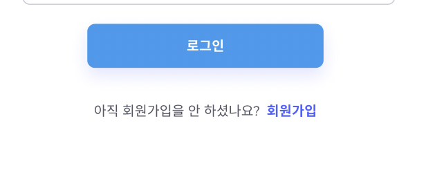

## 🚀 Single Page Application

---

작성일: 2022년 4월 2일

### 📌 SPA를 체감하다. 

팀프로젝트를 한참하던 시기로 다시 거슬러 올라간다. 로그인 페이지에 회원가입 페이지로 이동할 수 있는 아주 간단한 버튼? 을 추가중 이였는데,  
나는 js 에서 하던 것 처럼 a 태그를 사용할려고 하였다.  

학원에서 이미 제공해준 userMVP 를 살펴보던 중 a태그를 사용하지 않고, 페이지를 이동할 때
navigate 혹은 Link 컴포넌트 를 사용한 것을 알게 되었다. 팀프로젝트 당시에는 시간에 쫓기듯이 구현을 하고 있어서, 제대로 개념부터 공부하지 못하고, 일단 사용법만 익혀서 사용했었다.😭  

✅ 그럼 왜 a 태그를 사용하지 않을까..? 그냥 react 라서..? 아니면 다른 컴포넌트가 편해서...?😲  

이 부분에 대해 찾다보니, 다시 처음 react 특징 중 하나였던 Single Page Application 까지 다시 읽어보게 되었다.  

아무튼 서론? 은 여기까지하고,,, 그럼 왜 a 태그를 쓰지 않는지, react-router 와 SPA 가 뭔지, 나름대로 정리해보고자 한다!

### 1️⃣ React Router 란?

가장 먼저 라우팅과 라우터가 무엇인지 알아보자. 먼저 라우터는 길을 빠르게 찾아내는 역할, 라우팅은 길을 찾는 행위라고 보통 이야기한다.

> 💡 잘 기억에 나지 않지만....네트워크 보안..?..과목에서 어렴풋이 떠오르는 교수님의 설명을 적어보자면..만약 대구에서 서울로 갈려고 한다면, 여러가지 길이 있다! 그럼 네비게이션이 구간마다 (ex. 대구-대전, 대전-서울) 어떤 길로 가야지 편할지 계속 찾아내는데, 이것을 라우터라고 이해를 하고, 이러한 행위를 라우팅이라고 이해를 했던 기억이 있다.

**웹 어플리케이션 관점에서 라우팅은 사용자가 요청한 URL 에 따라 알맞은 페이지를 보여주는 것이다.**

리액트에서 라우팅 시스템을 구축하기 위해 가장 많이 사용하는 라이브러리 중 하나가 React Router 이다.

### 2️⃣ Single Page Application (+ Multi Page Application) ?

SPA를 일단 해석을 해보면 한개의 페이지로 구성된 어플리케이션이라고 해석할 수 있다.  
반대로 MPA 는 여러개의 페이지로 구성된 어플리케이션이다.  
그럼 한개의 페이지로 이루어졌다는 것이 정말 한개의 페이지로만 이루어졌다는 것일까...? 그럼 React로는 사이트를 만들 수가 없다. 로그인 페이지만 있는 사이트는 없으니까.....그렇다면 React 가 이렇게 많이 쓰이지 못 했을 것이다.  

SPA 를 쉽게 이해하기 위해서는 MPA 방식을 먼저 이해할 필요가 있다.  
MPA 는 사용자가 새로운 페이지로 이동할 때마다 새로운 html 을 받아온다. 각 페이지마다 다른 html 파일을 사용한다. ex. hompage.html, login.html, mypage.html ...  
만약 사용자가 로그인페이지로 이동하기 위해서는, 새로운 페이지를 웹서버가 요청하게 되고, 요청한 페이지를 다시 랜더링하게 된다. (그래서 MPA 로 이루어진 웹사이트는 새로운 페이지를 들어갈때마다 ⭐️새로고침이 된다!)  

그럼 SPA 는 무엇일까? 일단 말그대로 한개의 페이지로 이루졌다고 이해할 수 있다..그럼 정말 페이지 이동은 없는 것일까...? 그건 아니다. 쉽게 이야기하면...homepage.html , login.html, mypage.html 이 각각 있는 것이 아니라, index.html 에 모든 것이 들어있다. 그렇기 때문에, 사용자가 로그인페이지를 요청하여도, 마이페이지를 요청하여도 , 웹서버는 index.html 을 반환하고, 필요한 정보만 받아서 그 정보를 기준으로 업데이트 된다. (업데이트만 되기때문에, 페이지가 새로고침되지않는다!) 그렇기 때문에 기술적으로는 한개의 페이지가 존재하지만, 사용자가 느끼기에는 여러개의 페이지가 있다고 느끼는 것이다.👍  

### 3️⃣ a 태그를 사용하면 안되는 이유!

그럼 왜 react에서는 a태그를 사용하지 않을까...?   사실 위에서 다 설명이 되었는데,
SPA 방식에 맞지 않다는 것이다. SPA 방식의 장점 중 하나가 새로고침이 되지않는다는 것인데, a태그를 사용할 경우, 다시 새로고침이 되기때문에, 사용을 권장하지 않고, Link 컴포넌트, navigate 컴포넌트의 사용을 권장한다고 한다!  

### 📍 SPA, MPA 와 밀접한 관련있는 [SSR, CSR, SEO에 관한 WIL](https://github.com/Nayeon97/WIL/blob/2fa3321ed0bc078dfc7789b52f9b9cc792aeb45a/React/SSR,%20CSR.md)을 작성하였습니다. (2022.4.14)

---

#### 🥲 고민...TIL 잘 쓰고 싶다....

TIL 을 잘 쓰고 싶은데, 생각처럼 되지 않는 것 같다. 간단히 작성하고자 시작한 글도 개념을 찾고 공부하다 보면, 간단명료한 글이 아닌 것 같아서 아쉽다... 하지만 이 부분은 내가 아직 모르는 것이 많기에, 한 개를 공부하다 보면 실타래처럼 모르는 개념들이 얽혀서 나오게 되어 그런 것 같아서, 이 부분은 공부를 하다보면, 점점 아는 것이 많아지고 그럼 점점 간단 명료한 글이 되지 않을까..생각하는 나의 바람이다.🙏 이번에 팀 프로젝트를 하면서 기록의 중요성을 알게 된 만큼, 시간이 조금 걸리더라도 꾸준히 기록하자!
