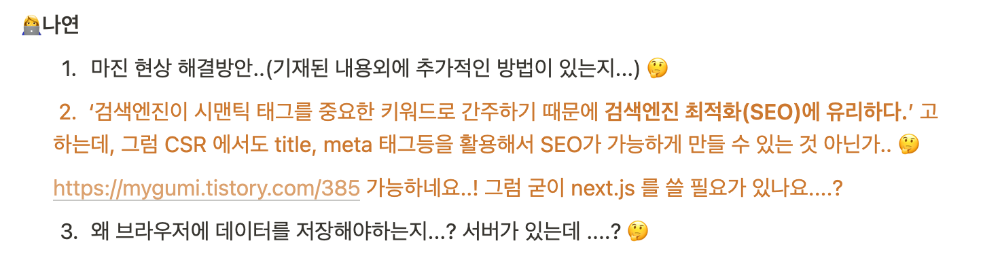

## 🚀 SSR 과 CSR, 그리고 SEO

---

작성일: 2022년 4월 14일

           💡 첫번째 면접 스터디를 위해 공부했던 CSR, SSR 에 대해 알아보자!

[프론트엔드 면접 스터디 참고 자료 ](https://github.com/baeharam/Must-Know-About-Frontend)

### 1️⃣ SSR (Server Side Rendering) 란?

> SSR에선 브라우저가 페이지를 요청할 때마다 해당 페이지에 관련된 HTML, CSS, JS 파일 및 데이터를 받아와서 렌더링을 시킨다.

전통적인 방식으로, 브라우저에 나타나는 형태 그대로 HTML을 만들어서 제공하고, 브라우저는 HTML을 표시하는 방식이다. 가장 큰 문제점은 사용자의 인터렉션에 따른 페이지의 변화마다 서버에 request 요청을 하고, 요청 시 마다 새로고침이 일어나고, 페이지를 로딩할 때마다 서버로부터 리소스를 전달받아 해석하고 화면에 렌더링되는 방식이였기에, 다양한 사용자 인터렉션이 요구되는 현재의 웹 어플리케이션에서는 좋지않은 방법이다.. 그래서! CSR이 등장하였다고 한다!

### 2️⃣ CSR (Client Side Rendering) 란?

> 초기 서버 요청 시 html(하나의 페이지), js, css를 모두 받아온다. 그리고 난 후 javascript로 DOM을 생성하고 DOM 생성 시 필요한 데이터는 API 서버 호출을 통해서 받아온다. DOM구성을 javascript로 동적으로 구성하기 때문에 Client Side Rendering이라고 한다.

위의 설명을 읽고나서, SSR의 단점을 보완했구나! 하는 것을 느낄 수 있었다.

사용자의 요청에 따라 필요한 부분만 다시 읽어들이기 때문에, SSR 보다는 빠른 인터렉션이 장점이다. 그리고 새로고침이 발생하지 않기 때문에 사용자 경험 또한
SSR 보다 좋다!

그럼 이전에 SPA, MPA 방식에 대해 공부하였었는데 [(정리한 글)](https://github.com/Nayeon97/WIL/blob/14d7d5aaf41a6525429643a82db96f59db1593f3/React/SPA%EC%97%90%20%EB%8C%80%ED%95%B4%20%EC%95%8C%EA%B2%8C%EB%90%98%EB%8B%A4.md), SPA를 구현하기 위해서는 CSR 방식을 사용하고 , MPA를 구현하기 위해서는 SSR 방식을 사용한 것을 알수 있다!

SSR, CSR에 대한 자료를 읽다보면, SSR의 장점으로 검색엔진최적화(SEO) 가능하고, CSR 단점으로는 검색엔진최적화(SEO)를 구현하기가 어렵다고 한다.

### 3️⃣ SEO란...?

> SEO(검색 엔진 최적화)는 웹사이트가 검색 결과에 더 잘 보이도록 최적화하는 과정입니다. 검색 랭크 개선이라고도 합니다.
> 검색 엔진은 웹을 크롤링 (en-US)하면서 페이지에서 페이지로 링크를 따라가고, 찾은 콘텐츠의 색인을 생성합니다. 검색 결과에 보이는 것은 바로 그 콘텐츠 색인입니다. 크롤러는 일정 규칙을 따르므로, SEO를 진행하며 해당 규칙을 밀접하게 따라가면 웹사이트가 검색 결과의 보다 높은 곳에 노출돼 (전자상거래와 광고라면) 수익으로 연결될 수도 있습니다.

공식문서에 기재되어있는 설명이다. 아하..웹사이트에서 검색 결과에 더 잘보이도록 최적화하는 과정이구나..까지는 이해를 했지만, 크롤링은 들어봤지만, 사실 정확한 의미는 모른다.. 그럼 일단 크롤링이 무엇인지부터 알아보자!

### 4️⃣ 크롤링이란..?

✔️ **크롤링은 웹 페이지를 그대로 가져와서 거기서 데이터를 추출해 내는 행위를 뜻한다. 크롤링하는 소프트웨어를 크롤러라고 부른다.**
왜 CSR 을 사용하면 크롤링이 안되는 것이지..? 에 대해 검색을 하던 중에 쉽게 설명해 놓은 [블로그](https://walk-through-me.tistory.com/77)를 발견했다!  
! CSR은 최초로 불러오는 html에는 html, body 태그만 존재하고, js 파일의 다운로드가 완료되고나면, js파일이 내용을 보여주는데! SSR의 경우네는 서버에서 첫 페이지를 랜더링 해주기때문에! SSR이 CSR 보다 유리하다는 것이다!

그럼 CSR 은 SEO를 왜 할 수 없는 것인가........?

### 5️⃣ CSR 방식은 SEO가 되지않는다! 는 오해..

CSR 에서 SEO 가 되지않는다는 것은 오해라고 한다! 많은 크롤러들이 JS 를 지원하지 않기때문에 생긴 오해인데, 최신 버전의 Google Bot 은 ES2015 이상의 최신 JS를 지원하기때문에, 안된다고 하는 것은 X.

### 6️⃣ SSR 과 CSR 을 함께 사용하는 방법을 알고있는지...?

면접 스터디에서 나온 질문이다. CSR과 SSR 의 장점을 합치면, html 파일이 한개이기때문에, 빠른 인터렉션과 사용자 경험이 좋을 것이고, SEO를 고려해서 페이지를 만들 수 있을 것이다.

💡 Next.js 가 있다!  
 Next.js 는 React 로 만드는 서버사이드 렌더링 프레인 워크이다.  
 [블로그](https://velog.io/@secho/Next.js-SSR%EC%9D%B4%EB%9D%BC%EA%B3%A0%EB%A7%8C-%EC%95%8C%EA%B3%A0%EC%9E%88%EC%97%88%EB%8B%A4) 에서 엄청 자세히 잘 정리가 되어있는데 ... 사실 아직 모르는 내용들이 많고, 사용해보지 않아서 잘 체감이 되지않는다...

오늘 WIL 은 SSR, CSR, SEO 을 정리하는 것에 끝을 내지만! Next.js 도 추후에 공부해보자!

---

2022.4.18일 업데이트

## 🙋‍♀️ title 태그와 meta 태그로 SEO 커버가 가능한데 왜 next.js를....?

면접 스터디를 준비하던 중에, title 태그와 meta 태그로 SEO 커버가 가능하다는 사실을 알았다! 그럼 왜 next.js 가 등장한 것일까..? 하는 의문이 생겨서, 매주 면접스터디에 세개의 질문리스트를 미리 작성해야하는데, 나의 세개의 질문 중 한개를 작성할 수 있었다!



일단 이 질문을 해결하기전에! title 태그와 meta 태그에 대해 먼저 정리해보자!

### ✅ title 태그

✔️ 해당 문서의 제목을 정의할 때 사용한다!  
✔️ 브라우저의 제목 표시줄이나 페이지 탭의 제목으로 사용, 즐겨찾기 등록 시 해당 페이지에 대한 즐겨찾기 이름으로 사용!  
✔️ 모든 HTML 문서에는 title 태그가 필요하지만, 두개 이상은 사용할 수 없다.  
✔️ HTML 문서에 title 요소가 존재하지 않는다면 유효성 검사를 통과할 수 없다!

### ✅ meta 태그

✔️ 해당 문서에 대한 정보(metadata) 정의하기 위해 사용! -> 브라우저나 검색 엔진 최적화, 다른 웹 서비스에서 사용된다.  
✔️ `<head>` 요소 내부에 위치한다.  
✔️ 만약 name 속성이나 http-equiv 속성이 명시되었다면, 반드시 content 속성도 함께 명시한다.

```html
<!-- 검색 엔진을 위한 키워드를 정의하는 예제 !악용사례로 인해 현재는 거의 사용 X-->
<meta name="keyword" content="HTML, meta, tag, element, reference" />
<!-- 웹 페이지에 대한 설명을 정의하는 예제 -->
<meta name="description" content="HTML meta tag page" />
<!-- 문서의 저자를 정의하는 예제 -->
<meta name="author" content="TCPSchool" />
<!-- 5초 뒤에 다른 페이지로 리다이렉트시키는 예제 -->
<meta http-equiv="refresh" content="5;url=http://www.tcpschool.com" />
<!-- 모든 장치에서 웹 사이트가 잘 보이도록 뷰포트를 설정하는 예제 -->
<meta name="viewport" content="width=device-width, initial-scale=1.0" />
```

### 그럼 다시 질문으로 돌아와서...🏃‍♀️

왜? next.js 를 쓸까...?

> CSR 은 html 파일이 한개다!
> 이것이 답이다!! CSR 은 html이 한 개이기 때문에, 여기에 모든 title, meta 정보를 넣은 것은 거의 불가능할 뿐더러, 낭비가 심하다! 심지어 title 은 두 개 이상 사용이 불가능하다!! 그렇기 때문에 next.js 를 쓰자!

---

https://developer.mozilla.org/ko/docs/Glossary/SEO  
https://hyunseob.github.io/2019/05/26/google-io-2019-day-3/  
https://velog.io/@zansol%ED%99%95%EC%9D%B8%ED%95%98%EA%B8%B0-%EC%84%9C%EB%B2%84%EC%82%AC%EC%9D%B4%EB%93%9C%EB%A0%8C%EB%8D%94%EB%A7%81SSR-%ED%81%B4%EB%9D%BC%EC%9D%B4%EC%96%B8%ED%8A%B8%EC%82%AC%EC%9D%B4%EB%93%9C%EB%A0%8C%EB%8D%94%EB%A7%81CSR  
https://minsoftk.tistory.com/68
