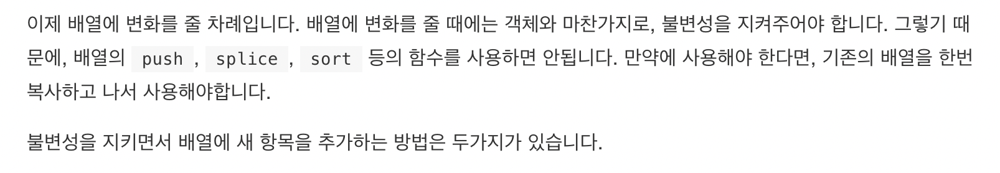

## 🚀 Spread Syntax를 왜 사용할까..?

    💡 리액트에서 setState를 통해 상태값을 업데이트 시킬때 나는 항상 전개 연산자를 사용했다. 왜? Spread Syntax를
     사용했냐면, 다들 쓰길래...! 조금 더 구체적으로 말하자면, 처음으로 전개 연산자를 사용하게 된 것은 처음 리액트로 todoList를 만들때이다!
    추가한 내용이 업데이트 되도록 만들어야 했는데, 업데이트는 되지만! 문제는 업데이트된 값 이외에 이전에 있던 내용은 삭제되는 문제가 생겼었다.
    이때 구글에 검색해보니, 거의 모든 코드에서 전개연산자로 이전 값들을 유지시키길래, 그냥 나도 따라썼다...🥲 그렇게 그냥 아무런 의심없이
    쓰다가, 최근에 useContext 에 대해 공부하기 위해 자료를 찾아보던 중에 벨로퍼트님의 모던 리액트 자료에서 배열 부분이 있길래, 그냥 아무
    생각없이 클릭했다가 ...😱  이유를 생각하지 않고 코드를 쓴 나를 반성하게 되었다. 다른사람에게 내가 이런 식으로 코드를 작성한 이유를 설명할
    수 있도록 공부하자!!

---

작성일: 2022년 4월 15일



### 1️⃣ Spread Operator 를 사용하는 이유? 대중적이라서? 놉!!😡 불변성때문에!!

불변성때문이라는 문장을 읽자마자 아찔했다. 갑자기 면접이 상상되었다..  
🗣 혹시 리액트에서 state 값이 배열 혹은 객체일때 어떻게 값을 추가하나요?  
😄 전개 연산자를 사용합니다.  
🗣 왜 사용하는지 아시나요?  
😅 잘 모릅니다..  
🗣 이유를 모르지만, 전개 연산자를 사용하신 이유가 있나요..?  
🤦‍♀️ 없습니다.....

다시 한번 느낀다.. 다른사람에게 내가 이런 식으로 코드를 작성한 이유를 설명할 수 있도록 공부하자!!

그럼 일단 불변성이 무엇인지부터 알아보자!

### 2️⃣ 불변성이란?

불변성은 과학시간에도 정말 많이 들었던 것 같은데, 변하지 않는 성질로 알고있다!  
자바스크립트를 공부하면서도 들어봤던 불변성이 있다. 바로 객체 타입의 불변성!

(사실 이 부분에 대해서도 WIL에 계속 언급이 되었는데, JS에서 얕은 복사, 깊은 복사 그리고 모던자바스크립트 6장 데이터 타입에서 언급이 되었다. 하지만, 이만큼 중요했는지는 몰랐던 것 같다... 그냥 객체는 원시값들과는 다르게 불변한 값이아니라 변할 수 있구나! 그래서 얕은 복사와 깊은 복사로 나누어지는 구나..! 정도로 알고 있었다..😅 지금 살펴보니 모던JS 뒷부분에서 객체와 불변성에 대한 내용이 있다! 다시 한번 모던 JS를 완독하겠다는 다짐을 해본다...(어쩌다보니 글이 반성문이 되어가는 느낌이다..))

아무튼 다시 돌아와서 객체는 새로운 값이 만들어지지 않고 원래 원본에서 변경이 가능하다.  
배열 또한 객체와 똑같다!

### 3️⃣ 원본 값이 변경되는 것이 좋지 않은건가요..? 불변성을 지키는 것이 중요한가요...? 🤔

원본 값을 유지하는 것이 중요한가..? 하는 생각이 들었다. 왜 불변성을 지키는 것이 중요한가!

✅ 유지보수가 가능하고 가독성이 좋은 코드를 작성하기 위해서! 라고 한다..!!

유지보수가 가능하고 가독성이 좋은 코드를 작성하기 위해서는 왜 불변성을 지키는 것이 중요할까..?

예를 들어, 내가 A마트에 바나나를 주문했다! 그런데, 바나나를 주문하고 나니 오렌지도 먹고 싶어져서 오렌지를 추가로 주문했다고 가정하자. 이때 A마트의 시스템은 추가 영수증이 발급되는 것이 아니라,기존 영수증에 그냥 고객이 추가주문한 물품이 추가로 기재된다고 가정하다. 즉 무엇을 추가 주문한건지 따로 표시X. 그런데 나중에 내가 갑자기 바나나를 추가 주문한건지? 오렌지를 주문한것인지? 궁금해져서 마트에 문의를 해봐도, 영수증에는 아무런 표시없이 오렌지와 바나나가 기재되어있기 때문에, 고객이 무엇을 추가로 주문한 것인지 마트에서는 알수가 없다! -> 그럼 A마트는 어떤 해결책을 세워야 할까..?

기존 영수증에서 품목을 추가하는 것이 아닌, 추가 영수증을 만들면된다! 고객의 주문내역 흐름이 보이도록..!!

그래서 사용하는 것 전개 연산자!!

```js
const obj = { a: 1, b: 2 }
const obj2 = { ...obj }

console.log(obj === obj2) // false
```

너무 장황하게 이야기를 한 것같은데.. `불변성이 지켜지지 않으면 객체 내부의 값이 새로워져도 바뀐것을 감지하지 못한다. 그렇기때문에 불변성을 지키기 위해 전개 연산자를 사용한다.` 라고 이해하면 좋을 것 같다!

### 4️⃣ immer

그런데 배열, 객체의 구조가 많이 복잡해진다면 전개 연산자를 사용하여, 불변성을 유지하면서 업데이트 하는 것도 까다로워진다고 한다...이런 문제를 개선하기 위해 불변성을 쉽게 유지하도록 도와주는 라이브러리가 있다.
immer 라이브러리 사용방법은 사실 이미 많은 자료가 있기때문에, 따로 정리하지는 않겠다! ( 만약 사용하다가 궁금한 부분이 생기면 정리할 예정! )

---

https://velog.io/@_seeul/React-React%EC%9D%98-state%EA%B0%80-%EB%B6%88%EB%B3%80%EC%84%B1%EC%9D%84-%EA%B0%80%EC%A0%B8%EC%95%BC%ED%95%98%EB%8A%94-%EC%9D%B4%EC%9C%A0
