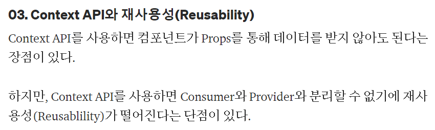

## 🚀 useContext 를 많이 쓰면 안된다...?

---

작성일: 2022년 4월 12일

        🤔 코테 스터디가 끝나고, 잠시 리액트에 대해 이야기를 나누던 중에, useContext 에 대해 스터디원 한분이 useContext 를 많이 쓰면 좋지않다는
        이야기를 들으셨다고 한다. useContext 를 사용하면, 남발하는 Props 전달을 예방할 수 있는데...
         왜?????? 라는 생각에 이번 WIL 의 주제는 useContext 이다.

### 1️⃣ useContext 란?

**<u>context를 이용하면 단계마다 일일이 props를 넘겨주지 않고도 컴포넌트 트리 전체에 데이터를 제공할 수 있습니다.</u>**

> 💡 일반적인 React 애플리케이션에서 데이터는 위에서 아래로 (즉, 부모로부터 자식에게) props를 통해 전달되지만, 애플리케이션 안의 여러 컴포넌트들에 전해줘야 하는 props의 경우 (예를 들면 선호 로케일, UI 테마) 이 과정이 번거로울 수 있습니다. context를 이용하면, 트리 단계마다 명시적으로 props를 넘겨주지 않아도 많은 컴포넌트가 이러한 값을 공유하도록 할 수 있습니다.

리액트 공식문서 useContext에 관해 기재되어있는 설명이다.

공식 문서에 기재된 위의 설명만으로 useContext 에 대한 이해가 잘 되었다.( 언젠가 프로젝트 기간 코치님께 리액트 관련된 책 추천을 여쭤보았는데 책보다 공식문서! 라는 답변을 주셨는데, 그 이유가 이해가 되었다. )<br />
예를 들어서 다시 useContext 에 대해 말해보자면...음....🤔 (tmi...요즘 글을 쓸때, 최대한 나의 언어로 풀이해서 쓰고자 노력한다....아직 익숙하지 않아서 잘 되지는 않지만.. 계속해서 고민하다 보면, 되지않을까....?)
아무튼 다시 돌아와서 예를 들어 내가 대학병원에 5층에 있는 외과 A선생님에게 진료를 보아야한다면, 일단 1층에 있는 접수처에 접수를 할 것이다. <br />
그러고 나서 2층, 3층, 4층, 5층에 각 층에 접수처가 있다고 가정을 하고, 그럼 내가 5층에 있는 외과 A 선생님을 만나기 위해 2층에도 접수 -> 3층에도 접수 -> 4층에도 접수 -> 5층에도 접수 후에 선생님을 만나진 않는다!!!! 그저 1층에 한번 등록을 하고 5층으로 가서 나를 부르면 나는 진료실에 들어갈 것이다!

useContext 도 똑같다. 데이터를 중간 엘리먼트에 Props를 이용하여 계속 넘겨줄 필요가 없이 해당 데이터가 필요한 컴포넌트로 순간이동 시켜줄 수 있다!

### 2️⃣ useContext 사용방법 ?

✅ createContext : context 객체를 생성.

```js
const { Provider, Consumer } = React.createContext(defaultValue)
```

✔️ defaultValue : Context 를 사용하는 컴포넌트의 상위에 Provider가 없는 경우에 사용되는 값.  
 📍 Provider value로 `undefined` 를 전달하면, Consumer 가 defaultValue 를 사용하는 것을 막는다.

✅ Provider : 생성한 context를 하위 컴포넌트에게 전달하는 역할.  
 ✔️ 하나의 Provider 에 여러개의 Consumer 들이 연결 될 수 있다.

✅ Consumer : context의 변화를 감시하는 컴포넌트.  
 ✔️ context 변화를 감지하기 위한 리액트 컴포넌트.

✅ 순서

1. 최상단 컴포넌트에서 createContext를 import.
2. 'UserContext'라는 변수에 담아 내보낼 준비를 한다.
3. 사용하고자 하는 state를 value값에 담아 변수로 지정한다.
4. 하위 컴포넌트들을 UserContext.Provider로 감싸고, value값을 보내준다.

```js
import React, { createContext } from 'react'
import Children from './Children'

export const UserContext = createContext(defaultValue)
// defaultValue : Context 를 사용하는 컴포넌트의 상위에 Provider가 없는 경우에 사용되는 값.

const App = () => {
  const user = {
    userId: 'abcd',
    userName: '나연',
  }

  return (
    <>
      <UserContext.Provider value={user}>
        <div>
          <User />
        </div>
      </UserContext.Provider>
    </>
  )
}

export default App
```

데이터를 사용해야하는 해당 컴포넌트에서 useContext 를 사용하는 방법에는 두가지가 있다.

✅ 첫번째 방법

```js
import React from 'react'
import { UserContext } from './App'

const User = () => {
  return (
    <UserContext.Consumer>
      {(user) => (
        <>
          <h2>userId는 {user.userId}입니다.</h2>
          <h2>userName {user.userName}입니다.</h2>
        </>
      )}
    </UserContext.Consumer>
  )
}

export default User
```

✅ 두번째 방법

```js
import React from 'react'
import { userContext } from './App'
import { UserContext } from 'react'

const User = () => {
  const { userId, userName } = useContext(UserContext)

  return (
    <>
      <h2>userId :{userId}</h2>
      <h2>userName :{userName}</h2>
    </>
  )
}

export default User
```

이 두 방법의 차이점을 아직 찾지는 못했는데, 내 생각에는 데이터를 가져와서 바로 출력만 한다면 consumer 을 사용하는 것이 편할 것 같고, 데이터를 이용해야한다면 두번째 방법이 편할 것같다. 나의 경우네는 두번째 방법이 조금 더 편해서 사용중이다..다만, 출력만 해야하는 경우가 생긴다면 첫번째 방법을 사용할 것같다!  
이부분은 조금 더 보충해야 할 것 같다!

### 3️⃣ context를 사용하기 전에 고려할 것

> context의 주된 용도는 다양한 레벨에 네스팅된 많은 컴포넌트에게 데이터를 전달하는 것입니다.  
>  context를 사용하면 컴포넌트를 재사용하기가 어려워지므로 꼭 필요할 때만 쓰세요.  
>  여러 레벨에 걸쳐 props 넘기는 걸 대체하는 데에 context보다 컴포넌트 합성이 더 간단한 해결책일 수도 있습니다.

공식문서에 기재된 내용이다.  
왜...? 컴포넌트를 재사용하기가 어려워질까....? 이 부분을 이해해보자.

### 4️⃣ useContext에서 컴포넌트 재사용이 어렵다...?



이 부분과 관련해서 스터디 팀원분이 올려주신 설명이다...!!  
이 부분은 사실 이해가 완벽하게 되지 않는것같다 ㅠㅠ 약간 ..음 그렇구나...  
그냥 무조건 Provider 안에 감싸져 있어야..value 를 받을 수 있으니까.. 분리가 안되는 구나 -> 그래서 재사용성이 떨어진다는구나! 이정도의 느낌이다...  
조금 더 고민하고 자료를 찾아봐야 할 것 같다. (사실 이 부분을 완벽히 한 상태에서 글을 쓰고 싶어서, 계속 글을 완성하는 것을 미루게 되었는데, 마냥 미룰수는 없어서 이렇게 적어두고, 수정할 예정이다!)

### 5️⃣ 주의사항! 모든 하위 컴포넌트가 렌더링된다...!!

**useContext 의 단점으로 Provider의 부모가 렌더링 될 때마다 불필요하게 하위 컴포넌트가 다시 렌더링 되는 문제가 생길 수 있다!!😬 하지만 역시나.. 문제 해결방법은 존재하였다!**

✅ 해결책 : useMemo 사용하기.

```js
function CountProvider(props) {
  const [count, setCount] = React.useState(0)
  const value = React.useMemo(() => [state, setCount], [count])
  return <CountContext.Provider value={value} {...props} />
}
```

useMemo를 사용하게 되면, state 값이 변경될 때만, 렌더링되도록 할 수 있기때문에, 불필요한 렌더링을 방지할 수 있다고 한다. 다만 이게 최선인지는 모르겠다...

```js
function CountProvider(props) {
  const [count, setCount] = React.useState(0)
  const value = React.useMemo(() => [state, setCount], [count])
  return
  ;<CountContext.Provider value={value} {...props}>
    <useCountContextComponent />
    <notUseCountContextComponent />
  </CountContext.Provider>
}
```

예를 들어 위에서 useCountContextComponent 는 CountContext.Provider에 넘겨준 value 를 사용하지만,notUseCountContextComponent 는 사용하지 않는 컴포넌트라고 하면, 결국 value 값이 바뀔 때 value 를 사용하지 않는 notUseCountContextComponent 컴포넌트도 렌더링 된다!  
그렇기에 useMemo 가 확실한 해결책은 아닌것 같다는 의문이 생겼다.. 그렇기에 리덕스를 사용하나..? 하는 생각이 들었다..!

해당 자료를 더 찾다보니 [블로그](https://velog.io/@yrnana/Context-API%EA%B0%80-%EC%A1%B4%EC%9E%AC%ED%95%98%EC%A7%80%EB%A7%8C-%EC%97%AC%EC%A0%84%ED%9E%88-%EC%82%AC%EB%9E%8C%EB%93%A4%EC%9D%B4-redux%EC%99%80-%EC%A0%84%EC%97%AD-%EC%83%81%ED%83%9C%EA%B4%80%EB%A6%AC-%EB%9D%BC%EC%9D%B4%EB%B8%8C%EB%9F%AC%EB%A6%AC%EB%A5%BC-%EC%93%B0%EB%8A%94-%EC%9D%B4%EC%9C%A0#context-api%EC%9D%98-%EB%AC%B8%EC%A0%9C) 를 발견하였는데, 여기서 컨텍스트를 상태값 / 액션으로 나누는 방법이 있었다! 다만, 모든 문제를 해결할 수 없고, 그렇기 때문에 많은 개발자들이 리덕스를 사용하고 있다고 한다..!!

이로써 나의 궁금증이 해결된 것 같다!!

물론 아직 많은 부분에서 부족하기에 지금의 글은 계속해서 조금씩 보완해나갈 예정이다!!

---

https://dongmin-jang.medium.com/reactjs-context-api-korean-%ED%95%9C%EA%B8%80-%EC%9E%91%EC%84%B1%EC%A4%91-79edaf18efff  
https://github.com/kentcdodds/old-kentcdodds.com/blob/319db97260078ea4c263e75166f05e2cea21ccd1/content/blog/how-to-optimize-your-context-value/index.md
