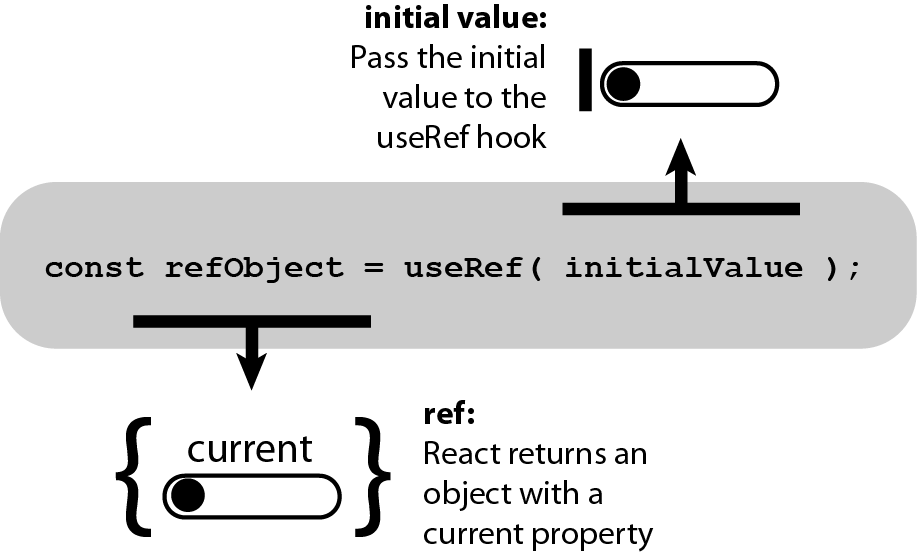

## 🚀 useRef

---

작성일: 2022년 5월 17일

### 1️⃣ useRef 란?

```js
const refContainer = useRef(initialValue);
```

useRef는 `.current` 프로퍼티로 전달된 인자(initialValue) 로 초기화된 변경 가능한 ref 객체를 반환,  
반환된 객체는 컴포넌트의 전 생애주기를 통해 유지된다고 한다.



### 2️⃣ useRef 를 사용하는 경우!

1.  특정 DOM 선택하기.
2.  컴포넌트 안의 변수 만들기.

### ⭐️ 특정 DOM 선택하기.

useRef 를 이용하여 특정 DOM 을 선택할 수 있는데, 나는 input 에 입력하지 않은 상태에서 전송버튼을 누르면 input 이 포커스되는 것을 useRef 를 이용하여 구현해본 적이 있다!

```js
import { useRef, useState } from 'react';

const Memo = () => {
  const memoInput = useRef();
  const [memo, setMemo] = useState('');

  const handleChangeState = (e) => {
    setMemo(e.target.value);
  };

  const handleSubmit = () => {
    if (memo.length < 1) {
      memoInput.current.focus();
      return;
    }

    console.log(state);
    alert('저장 성공!');
  };

  return (
    <div>
        <input
          ref={memoInput}
          value={memo}
          onChange={handleChangeState}
          type="text"
        />
      </div>
      <div>
        <button onClick={handleSubmit}>메모 저장하기</button>
      </div>
  );
};
export default Memo;
```

DOM 요소를 선택하는 부분은 이정도로만 하고 넘어가겠다!

### ⭐️ 컴포넌트 안의 변수 관리.

useRef로 변수를 관리하게 되면, 그 변수가 업데이트 된다고 해서 컴포넌트가 리렌더링 되지 않는다고 한다! 😮  
다만, 리액트 컴포넌트에서의 상태는 상태를 바꾸는 함수를 호출하고 나서 그 다음 렌더링 이후로 업데이트 된 상태를 조회 할 수 있지만,  
useRef 로 관리하고 있는 변수는 설정 후에 바로 조회가 가능하다고 한다!  
리렌더링을 할 필요가 없는 변수라면! useRef 로 관리해주자!

```js
import React, { useRef } from 'react';

export default function App() {
  const countRef = useRef(0);

  const plusCount = () => {
    countRef.current += 1;
  };

  return (
    <div className="App">
      <h1>{countRef.current}</h1>
      <button onClick={plusCount}>1 더하기</button>
      <button
        onClick={() => {
          console.log(countRef.current);
        }}
      >
        콘솔
      </button>
    </div>
  );
}
```

위의 코드를 실행해보면, 화면에 보이는 숫자는 0에서 바뀌지 않지만, console.log 를 찍어보면 값이 증가하고 있음을 알 수 있다!  
-> 그리고 이 값은 언마운트 될 때까지 유지!

리렌더링 필요없는 변수를 사용할 때 한번 사용해보자!

---

https://ko.reactjs.org/docs/hooks-reference.html#useref
https://hyeok999.github.io/2020/01/07/react-velo-10/
https://www.youtube.com/watch?v=VxqZrL4FLz8
